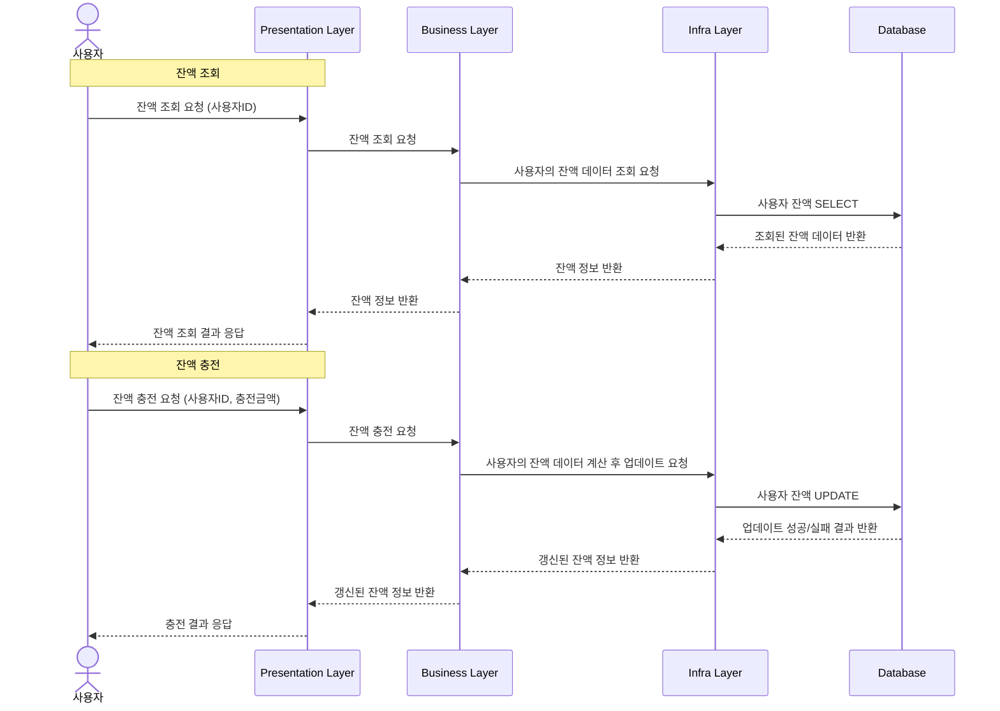
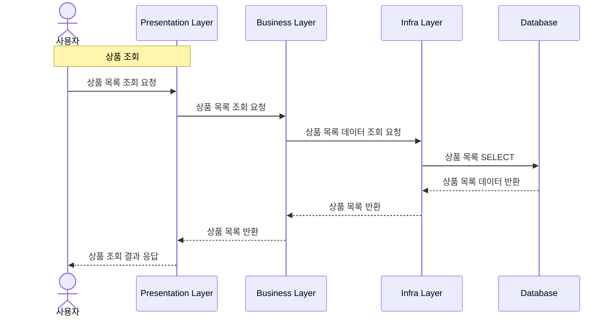
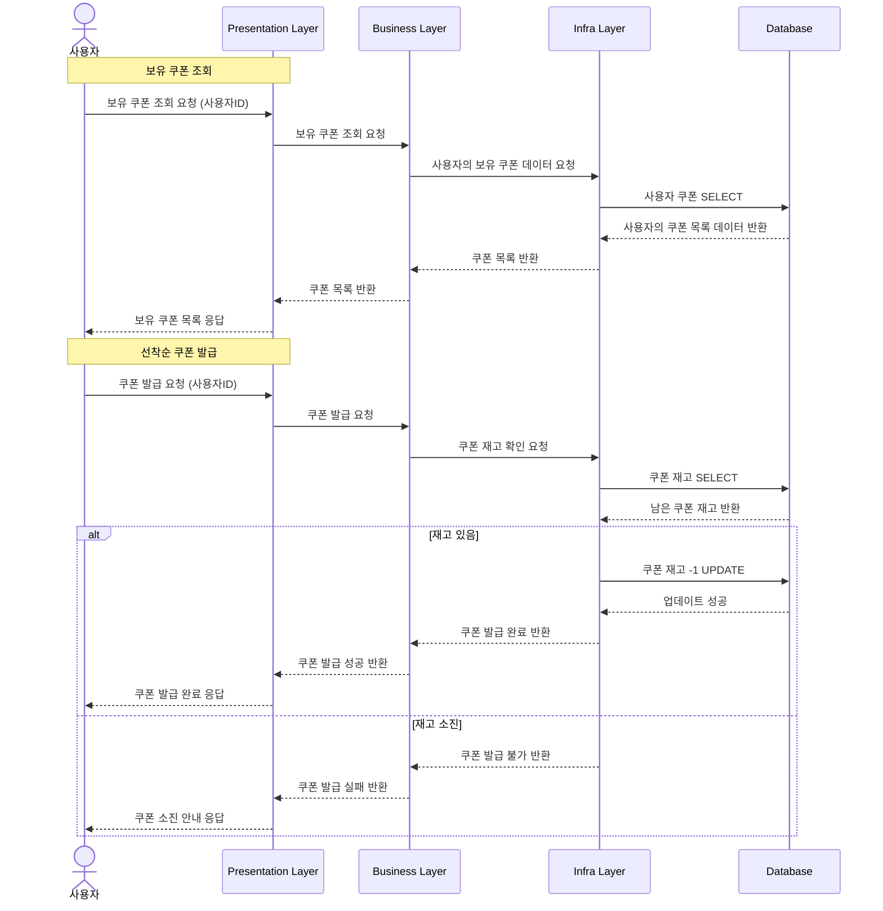
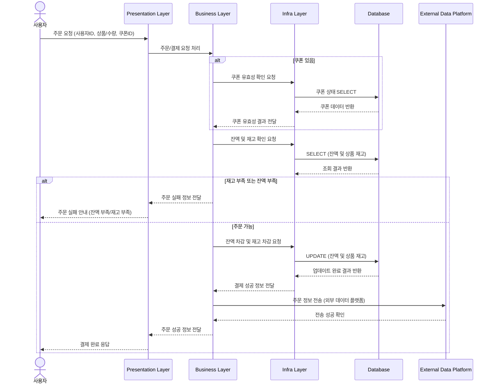
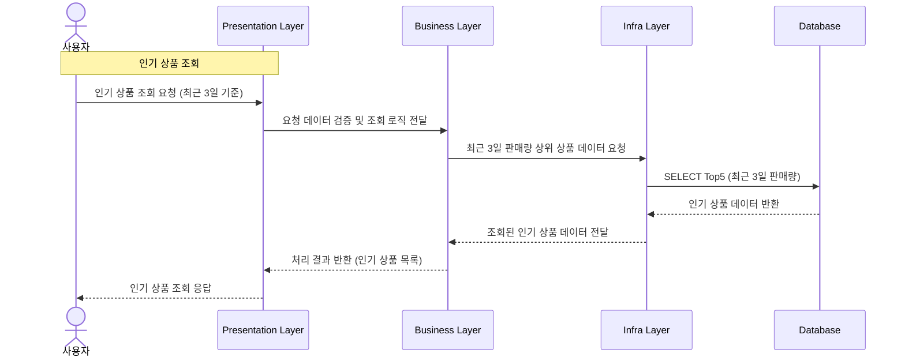
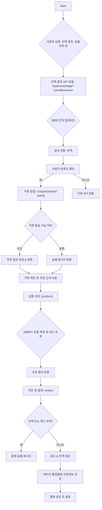

## hhplus-ecommerce
e-commerce 에서 자주 사용되는 기능들을 구현한 백엔드 프로젝트입니다.  
사용자의 잔액 관리, 상품 조회, 쿠폰 발급, 주문/결제, 인기 상품 통계 등 e-commerce의 주요 기능을 제공합니다.  
클린 아키텍처와 레이어드 아키텍처를 기반으로 DDD(Domain-Driven Design)를 적용하여, 도메인 중심의 비즈니스 로직을 명확히 분리하고 유연한 패키지 구조를 설계하고자 했습니다.


## Configuration
| **Role**           | **Component**                |
|---------------------|------------------------------|
| ☕ Programming      | **Java 17**                  |
| 🌱 Framework        | **Spring Boot 3.4.1**        |
| ✅ Testing          | **JUnit 5**                    |
| 🐬 Database         | **MySQL 8.0**                |
| 🐳 Containerization | **Docker**                   |
| 🛠 Cache            | **Redis**                    |
| ✉️ Messaging        | **Kafka**                    |


## [🔗 마일스톤](https://github.com/users/dhgudtmxhs/projects/3)
  
## 시퀀스 다이어그램

### 잔액 충전/조회


### 상품 조회

### 선착순 쿠폰 조회/발급

### 주문 / 결제


### 인기 상품 조회


### 플로우 차트


### ERD

### API

### MOCK API

## 초기 설계 패키지 구조 - 수정해야함
```plaintext
com
└── example
    └── ecommerce
        ├── order
        │   ├── interfaces
        │   │   ├── OrderController.java
        │   │   ├── OrderRequest.java
        │   │   ├── OrderResponse.java
        │   │   └── ...
        │   ├── application
        │   │   ├── OrderFacade.java
        │   │   ├── OrderCommand.java
        │   │   └── OrderInfo.java
        │   ├── domain
        │   │   ├── Order.java
        │   │   ├── OrderService.java
        │   │   └── OrderRepository.java
        │   └── infra
        │       ├── OrderJpaEntity.java
        │       ├── OrderRepositoryImpl.java
        │       └── JpaOrderRepository.java
        ├── product
        │   ├── interfaces
        │   │   ├── ProductController.java
        │   │   ├── ProductRequest.java
        │   │   ├── ProductResponse.java
        │   │   └── ...
        │   ├── application
        │   │   ├── ProductService.java
        │   │   ├── ProductCommand.java
        │   │   └── ProductInfo.java
        │   ├── domain
        │   │   ├── Product.java
        │   │   ├── ProductService.java
        │   │   └── ProductRepository.java
        │   └── infra
        │       ├── ProductJpaEntity.java
        │       ├── ProductRepositoryImpl.java
        │       └── JpaProductRepository.java
        ├── user
        │   ├── interfaces
        │   │   ├── UserController.java
        │   │   ├── UserRequest.java
        │   │   ├── UserResponse.java
        │   │   └── ...
        │   ├── application
        │   │   ├── UserService.java
        │   │   ├── UserCommand.java
        │   │   └── UserInfo.java
        │   ├── domain
        │   │   ├── User.java
        │   │   ├── UserService.java
        │   │   └── UserRepository.java
        │   └── infra
        │       ├── UserJpaEntity.java
        │       ├── UserRepositoryImpl.java
        │       └── JpaUserRepository.java
        └── coupon
            ├── interfaces
            │   ├── CouponController.java
            │   ├── CouponRequest.java
            │   └── CouponResponse.java
            ├── application
            │   ├── CouponService.java
            │   ├── CouponCommand.java
            │   └── CouponInfo.java
            ├── domain
            │   ├── Coupon.java
            │   ├── CouponService.java
            │   └── CouponRepository.java
            └── infra
                ├── CouponJpaEntity.java
                ├── CouponRepositoryImpl.java
                └── JpaCouponRepository.java
```


