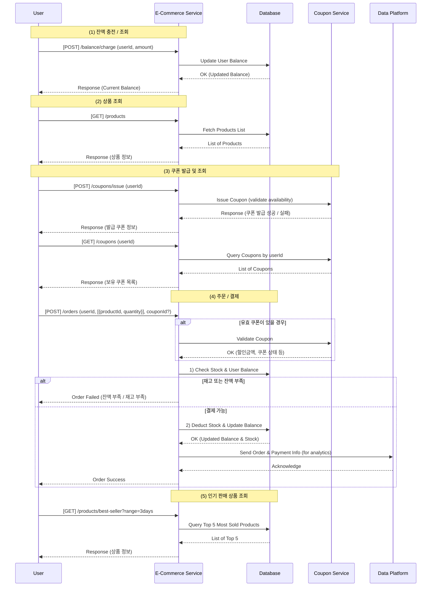
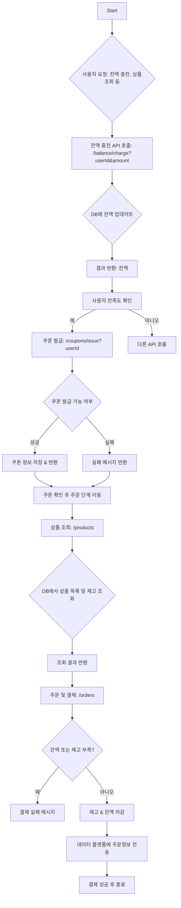

## hhplus-ecommerce 프로젝트
e-commerce 에서 자주 사용되는 기능들을 구현한 백엔드 프로젝트입니다.  
사용자의 잔액 관리, 상품 조회, 쿠폰 발급, 주문/결제, 인기 상품 통계 등 e-commerce의 주요 기능을 제공합니다.  
클린 아키텍처와 레이어드 아키텍처를 기반으로 DDD(Domain-Driven Design)를 적용하여, 도메인 중심의 비즈니스 로직을 명확히 분리하고 유연한 패키지 구조를 설계하고자 했습니다.

## package
...

## Configuration
| **Role**           | **Component**                |
|---------------------|------------------------------|
| ☕ Programming      | **Java 17**                  |
| 🌱 Framework        | **Spring Boot 3.4.1**        |
| ✅ Testing          | **JUnit 5**                    |
| 🐬 Database         | **MySQL 8.0**                |
| 🐳 Containerization | **Docker**                   |
| 🛠 Cache            | **Redis**                    |
| ✉️ Messaging        | **Kafka**                    |

#### [🔗 마일스톤](https://github.com/users/dhgudtmxhs/projects/3)
  
### 시퀀스 다이어그램

### 플로우 차트

### ERD

### API

### MOCK API

### package, configuration

