## hhplus-ecommerce
e-commerce 에서 자주 사용되는 기능들을 구현한 백엔드 프로젝트입니다.  
사용자의 잔액 관리, 상품 조회, 쿠폰 발급, 주문/결제, 인기 상품 통계 등 e-commerce의 주요 기능을 제공합니다.  
클린 아키텍처와 레이어드 아키텍처를 기반으로 DDD(Domain-Driven Design)를 적용하여, 도메인 중심의 비즈니스 로직을 명확히 분리하고 유연한 패키지 구조를 설계하고자 했습니다.


## Configuration
| **Role**           | **Component**                |
|---------------------|------------------------------|
| ☕ Programming      | **Java 17**                  |
| 🌱 Framework        | **Spring Boot 3.4.1**        |
| ✅ Testing          | **JUnit 5**                    |
| 🐬 Database         | **MySQL 8.0**                |
| 🐳 Containerization | **Docker**                   |
| 🛠 Cache            | **Redis**                    |
| ✉️ Messaging        | **Kafka**                    |


## [🔗 마일스톤](https://github.com/users/dhgudtmxhs/projects/3)
  
## 시퀀스 다이어그램

### 플로우 차트

#### 잔액 조회 / 잔액 충전

```mermaid
flowchart LR
    A[사용자] -->|잔액 조회 요청 사용자ID| B[Presentation Layer]
    B -->|잔액 조회 요청| C[Business Layer]
    C -->|사용자 잔액 데이터 조회 요청| D[Infra Layer]
    D -->|사용자 잔액 SELECT| E[Database]
    E -->|조회된 잔액 데이터 반환| D
    D -->|잔액 정보 반환| C
    C -->|잔액 정보 반환| B
    B -->|잔액 조회 결과 응답| A

    A2[사용자] -->|잔액 충전 요청 사용자ID, 충전금액| B2[Presentation Layer]
    B2 -->|잔액 충전 요청| C2[Business Layer]
    C2 -->|사용자 잔액 데이터 계산 후 업데이트 요청| D2[Infra Layer]
    D2 -->|사용자 잔액 UPDATE| E2[Database]
    E2 -->|업데이트 성공/실패 결과 반환| D2
    D2 -->|갱신된 잔액 정보 반환| C2
    C2 -->|갱신된 잔액 정보 반환| B2
    B2 -->|충전 결과 응답| A2
```


#### 상품 조회

```mermaid
flowchart LR
    A[사용자] -->|상품 목록 조회 요청| B[Presentation Layer]
    B -->|상품 목록 조회 요청| C[Business Layer]
    C -->|상품 목록 데이터 조회 요청| D[Infra Layer]
    D -->|상품 목록 SELECT| E[Database]
    E -->|상품 목록 데이터 반환| D
    D -->|상품 목록 반환| C
    C -->|상품 목록 반환| B
    B -->|상품 조회 결과 응답| A
```


#### 선착순 쿠폰 조회 / 발급

```mermaid
flowchart LR
    A[사용자] -->|보유 쿠폰 조회 요청 사용자ID| B[Presentation Layer]
    B -->|보유 쿠폰 조회 요청| C[Business Layer]
    C -->|사용자 보유 쿠폰 데이터 요청| D[Infra Layer]
    D -->|사용자 쿠폰 SELECT| E[Database]
    E -->|사용자 쿠폰 목록 반환| D
    D -->|쿠폰 목록 반환| C
    C -->|쿠폰 목록 반환| B
    B -->|보유 쿠폰 목록 응답| A

    A2[사용자] -->|쿠폰 발급 요청 사용자ID| B2[Presentation Layer]
    B2 -->|쿠폰 발급 요청| C2[Business Layer]
    C2 -->|쿠폰 재고 확인 요청| D2[Infra Layer]
    D2 -->|쿠폰 재고 SELECT| E2[Database]
    E2 -->|남은 쿠폰 재고 반환| D2
    D2 --> F{재고 있음?}
    F -->|YES| G[쿠폰 재고 -1 UPDATE]
    G -->|업데이트 성공| H[쿠폰 발급 완료]
    F -->|NO| I[쿠폰 발급 불가]
    H --> J[발급 성공 응답]
    I --> J
    J --> K[사용자 응답 전송]
```


#### 주문/결제

```mermaid
flowchart LR
    A[사용자] -->|주문 요청 | B[Presentation Layer]
    B -->|주문/결제 요청 처리| C[Business Layer]
    C --> D{쿠폰 확인}
    D -->|YES| E[쿠폰 유효성 확인 요청]
    E -->|쿠폰 상태 SELECT| F[Database]
    F -->|쿠폰 데이터 반환| E
    E -->|유효성 결과 반환| C
    D -->|NO| G[잔액 및 재고 확인 요청]
    G -->|SELECT 잔액/재고| H[Database]
    H -->|조회 결과 반환| G
    G --> I{재고 부족 or 잔액 부족}
    I -->|YES| J[주문 실패 응답]
    I -->|NO| K[잔액 차감 및 재고 차감 요청]
    K -->|UPDATE 잔액/재고| L[Database]
    L -->|업데이트 성공| M[주문 정보 전송]
    M -->|전송 성공| N[결제 성공 응답]
```


#### 인기 상품 조회

```mermaid
flowchart LR
    A[사용자] -->|인기 상품 조회 요청 최근 3일| B[Presentation Layer]
    B -->|인기 상품 조회 요청| C[Business Layer]
    C -->|최근 3일 판매량 상위 상품 조회 요청| D[Infra Layer]
    D -->|SELECT 최근 3일 판매량 TOP5| E[Database]
    E -->|인기 상품 목록 반환| D
    D -->|인기 상품 목록 반환| C
    C -->|인기 상품 목록 반환| B
    B -->|인기 상품 조회 결과 응답| A
```

### ERD

### API

### MOCK API

## 초기 설계 패키지 구조 - 수정해야함
```plaintext
com
└── example
    └── ecommerce
        ├── order
        │   ├── interfaces
        │   │   ├── OrderController.java
        │   │   ├── OrderRequest.java
        │   │   ├── OrderResponse.java
        │   │   └── ...
        │   ├── application
        │   │   ├── OrderFacade.java
        │   │   ├── OrderCommand.java
        │   │   └── OrderInfo.java
        │   ├── domain
        │   │   ├── Order.java
        │   │   ├── OrderService.java
        │   │   └── OrderRepository.java
        │   └── infra
        │       ├── OrderJpaEntity.java
        │       ├── OrderRepositoryImpl.java
        │       └── JpaOrderRepository.java
        ├── product
        │   ├── interfaces
        │   │   ├── ProductController.java
        │   │   ├── ProductRequest.java
        │   │   ├── ProductResponse.java
        │   │   └── ...
        │   ├── application
        │   │   ├── ProductService.java
        │   │   ├── ProductCommand.java
        │   │   └── ProductInfo.java
        │   ├── domain
        │   │   ├── Product.java
        │   │   ├── ProductService.java
        │   │   └── ProductRepository.java
        │   └── infra
        │       ├── ProductJpaEntity.java
        │       ├── ProductRepositoryImpl.java
        │       └── JpaProductRepository.java
        ├── user
        │   ├── interfaces
        │   │   ├── UserController.java
        │   │   ├── UserRequest.java
        │   │   ├── UserResponse.java
        │   │   └── ...
        │   ├── application
        │   │   ├── UserService.java
        │   │   ├── UserCommand.java
        │   │   └── UserInfo.java
        │   ├── domain
        │   │   ├── User.java
        │   │   ├── UserService.java
        │   │   └── UserRepository.java
        │   └── infra
        │       ├── UserJpaEntity.java
        │       ├── UserRepositoryImpl.java
        │       └── JpaUserRepository.java
        └── coupon
            ├── interfaces
            │   ├── CouponController.java
            │   ├── CouponRequest.java
            │   └── CouponResponse.java
            ├── application
            │   ├── CouponService.java
            │   ├── CouponCommand.java
            │   └── CouponInfo.java
            ├── domain
            │   ├── Coupon.java
            │   ├── CouponService.java
            │   └── CouponRepository.java
            └── infra
                ├── CouponJpaEntity.java
                ├── CouponRepositoryImpl.java
                └── JpaCouponRepository.java
```


