# hhplus-ecommere 프로젝트
test

### 마일스톤
https://github.com/users/dhgudtmxhs/projects/3

### 시퀀스 다이어그램

```mermaid
sequenceDiagram
    participant U as User
    participant S as E-Commerce Service
    participant DB as Database
    participant CP as Coupon Service
    participant DP as Data Platform

    Note over U,S: (1) 잔액 충전 / 조회
   
    U->>S: [POST] /balance/charge (userId, amount)
    S->>DB: Update User Balance
    DB-->>S: OK (Updated Balance)
    S-->>U: Response (Current Balance)

    Note over U,S: (2) 상품 조회

    U->>S: [GET] /products
    S->>DB: Fetch Products List
    DB-->>S: List of Products
    S-->>U: Response (상품 정보)

    Note over U,CP: (3) 쿠폰 발급 및 조회

    U->>S: [POST] /coupons/issue (userId)
    S->>CP: Issue Coupon (validate availability)
    CP-->>S: Response (쿠폰 발급 성공 / 실패)
    S-->>U: Response (발급 쿠폰 정보)

    U->>S: [GET] /coupons (userId)
    S->>CP: Query Coupons by userId
    CP-->>S: List of Coupons
    S-->>U: Response (보유 쿠폰 목록)

    Note over S,DB: (4) 주문 / 결제

    U->>S: [POST] /orders (userId, [{productId, quantity}], couponId?)
    alt 유효 쿠폰이 있을 경우
        S->>CP: Validate Coupon
        CP-->>S: OK (할인금액, 쿠폰 상태 등)
    end
    S->>DB: 1) Check Stock & User Balance
    alt 재고 또는 잔액 부족
        S-->>U: Order Failed (잔액 부족 / 재고 부족)
    else 결제 가능
        S->>DB: 2) Deduct Stock & Update Balance
        DB-->>S: OK (Updated Balance & Stock)
        S->>DP: Send Order & Payment Info (for analytics)
        DP-->>S: Acknowledge
        S-->>U: Order Success
    end

    Note over S,DB: (5) 인기 판매 상품 조회

    U->>S: [GET] /products/best-seller?range=3days
    S->>DB: Query Top 5 Most Sold Products
    DB-->>S: List of Top 5
    S-->>U: Response (상품 정보)
```

### 플로우 차트

```mermaid
flowchart TD
    A[Start] --> B{사용자 요청: 잔액 충전, 상품조회 등}
    B --> C[잔액 충전 API 호출: /balance/charge?userId&amount]
    C --> D{DB에 잔액 업데이트}
    D --> E[결과 반환: 잔액]
    E --> F[사용자 만족도 확인]
    F --> |예| G[쿠폰 발급: /coupons/issue?userId]
    F --> |아니오| H[다른 API 호출]

    G --> I{쿠폰 발급 가능 여부}
    I --> |성공| J[쿠폰 정보 저장 & 반환]
    I --> |실패| K[실패 메시지 반환]
    J --> L[쿠폰 확인 후 주문 단계 이동]
    K --> L

    L --> M[상품 조회: /products]
    M --> N{DB에서 상품 목록 및 재고 조회}
    N --> O[조회 결과 반환]

    O --> P[주문 및 결제: /orders]
    P --> Q{잔액 또는 재고 부족?}
    Q --> |예| R[결제 실패 메시지]
    Q --> |아니오| S[재고 & 잔액 차감]
    S --> T[데이터 플랫폼에 주문정보 전송]
    T --> U[결제 성공 후 종료]
```

### ERD

### API

### MOCK API

### package, configuration

## Configuration
| **Role**           | **Component**                |
|---------------------|------------------------------|
| ☕ Programming      | **Java 17**                  |
| 🌱 Framework        | **Spring Boot 3.4.1**        |
| ✅ Testing          | **JUnit 5**                    |
| 🐬 Database         | **MySQL 8.0**                |
| 🐳 Containerization | **Docker**                   |
| 🛠 Cache            | **Redis**                    |
| ✉️ Messaging        | **Kafka**                    |
